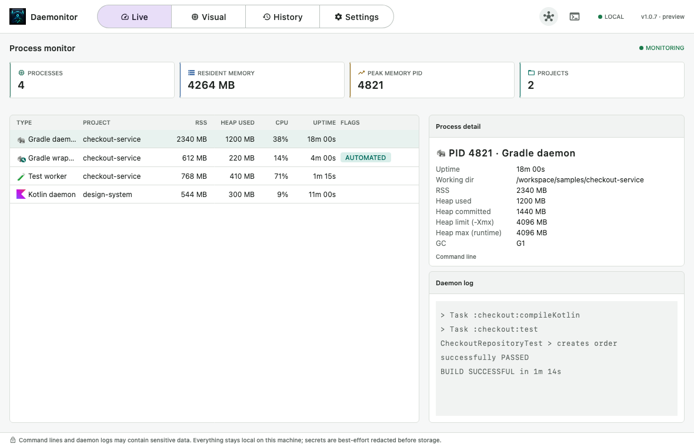
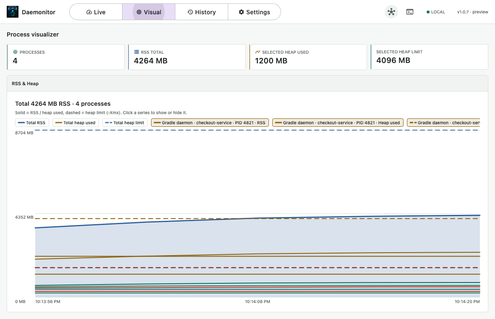
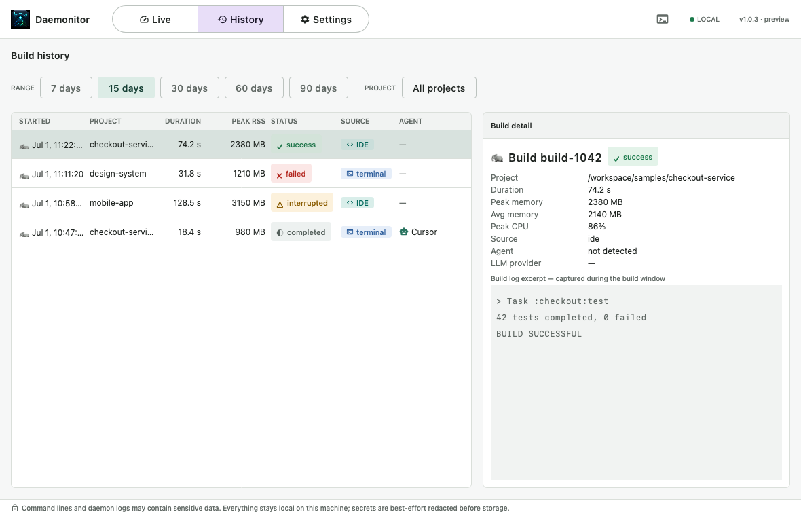

<p align="center">
  
</p>

# Daemonitor

> Activity Monitor for your Gradle daemons — see what's building right now, and what built recently.

Daemonitor is a local desktop app that shows the Gradle activity happening on your machine: which
daemons, wrappers, and test workers are running, how much memory and CPU they're using, the latest
daemon-log lines, and a searchable history of past builds — including **which AI coding agent
triggered each build**. It's built for the agentic-workflow era, where multiple IDEs, terminals, and
agents can all be driving Gradle at once.

Everything stays on your machine. No telemetry; command lines and logs are best-effort redacted
before they're ever stored. Outbound network use is limited to GitHub Releases update checks at
startup or from Settings, plus installer downloads that you explicitly approve.

[](https://github.com/cdsap/daemonitor/actions/workflows/ci.yml)


**Website:** [https://cdsap.github.io/daemonitor/](https://cdsap.github.io/daemonitor/)

---

## Features

### Live Monitor



*Live monitor with concurrent Gradle activity and the selected daemon inspector.*

- Every running Gradle-related JVM, classified by type with an at-a-glance icon:
  - 🐘 **Gradle daemon** · 🐘+🔧 **Gradle wrapper** · the **Kotlin** mark for the Kotlin daemon · 🧪 test worker · ☕ other Gradle-related JVM
- Per-process **RSS, CPU, and live-ticking uptime**
- Headline stats: active processes, total RSS, highest-memory PID, active projects
- Highlight badges: high/critical memory, `MULTI-BUILD` (a project with concurrent build invocations), `AUTOMATED` (CI/script/agent flags)
- Per-daemon detail with `-Xmx`, GC, working dir, full (redacted) command line, and a live tail of the daemon log
- Toolbar MCP status indicator next to one-click headless mode when you want collection to continue without the desktop window

### Visual



*Visual timeline of resident memory and configured heap for live Gradle processes.*

- Full-width **RSS & Heap** chart over a rolling window
- **Solid** series for RSS, **dashed** for configured heap (`-Xmx`) when recoverable
- Totals plus a legend for every process — click to show/hide series or focus selected heap

### Historical



*Build history with outcomes, source and agent tags, resource peaks, and a captured log excerpt.*

- Every reconstructed build, with start time, project, duration, peak RSS, **status** (✓ success / ✗ failed / ⚠ interrupted / ◐ completed), **source** (terminal / IDE), and **agent**
- Filter by project and time range
- Per-build detail with resource peaks and a captured log excerpt

### Settings
- Configurable **history retention** (default **15 days**, range 1–90). Lowering it purges out-of-range entries immediately.

### Headless collection

Daemonitor can keep collecting in the background without the desktop window. Use the toolbar action
to switch from desktop to headless mode, or start it directly with `--headless`. Packaged headless
mode uses the same local database and settings as the desktop app, shows a system tray/menu-bar icon
when the OS supports it, and offers **Open Daemonitor** and **Quit Daemonitor** actions from that
menu.

### MCP access

Daemonitor can also run as a local, read-only MCP server so agent tools can inspect retained build
history and currently visible Gradle-related processes. The MCP mode uses stdio, reads the same local
SQLite database as the desktop app, and exposes these tools:

- `daemonitor_search_history`: search retained builds by id, command, project, status, source, or agent.
- `daemonitor_builds_for_process`: find retained builds and process samples for a daemon PID or process text.
- `daemonitor_current_processes`: return the Gradle-related processes visible right now.

### AI-agent attribution
Daemonitor fingerprints the coding agent behind a build from the environment-variable *names* the
daemon recorded (names only — never values, staying within the redaction posture). It recognizes
Claude Code, Cursor, Codex, Gemini CLI, and Aider, and flags unrecognized agents explicitly.

It also **subtracts its own ambient environment** before attributing: if Daemonitor itself runs
inside, say, a Claude Code shell, every build would otherwise inherit those variables. Only signals
that distinguish a build from Daemonitor's own session are attributed, so you don't get "everything
is Claude."

---

## Requirements

- **JDK 17+** to run Gradle from source. The build uses a Java 21 toolchain, which Gradle
  auto-provisions when a local Java 21 installation is unavailable.
- macOS, Linux, or Windows
- Permission to read your own process list and Gradle daemon logs

Daemonitor reads Gradle daemon logs under `~/.gradle/daemon/<version>/` and enumerates processes
owned by the current user.

## Install

Daemonitor is distributed as a native desktop app per operating system:

| OS | First-time installer | In-app update package |
|----|----------------------|------------------------|
| macOS | `.dmg` | `.zip` app bundle |
| Windows | `.msi` | `.zip` app directory |
| Linux | `.deb` | `.tar.gz` standalone image |

Release asset names include the CPU architecture (`x64` or `arm64`), for example
`Daemonitor-1.0.7-macos-arm64.dmg` and `Daemonitor-1.0.7-macos-arm64.zip`.

The installed app does not require a project-local Gradle setup. It only reads local process
metadata and Gradle daemon logs for the current user.

Linux distribution starts with the GitHub Releases `.deb` for package installs and a `.tar.gz`
update package for writable standalone installs. Package-managed Linux prompts stay advisory; see
[Linux Update Distribution](docs/linux-update-distribution.md).

## Updates

Daemonitor checks GitHub Releases once at startup and marks the Settings tab as `Settings (1)` when
a newer version is available. The Settings tab can also check manually. When a newer release is
available, Daemonitor selects the matching artifact for the current operating system and CPU
architecture only after you approve the download, verifies the SHA-256 checksum from release
metadata, and either stages an update package for **Restart and Update** or opens the platform
installer when automatic installation is not supported for the current install. The app does not
silently install updates while it is running.

## Run from source

Source builds require **JDK 17+** to launch Gradle; the pinned Java 21 toolchain is provisioned
automatically when it is not installed locally.

```bash
./gradlew run
```

To collect and persist data without starting Compose or requiring a display server:

```bash
./gradlew runHeadless
```

Packaged launchers also accept `--headless`. Headless and desktop modes use the same local database
and retention setting. On desktop operating systems, the tray/menu-bar icon can reopen Daemonitor or
quit the collector. Stop source-run headless mode with `Ctrl+C` or the service manager's normal
termination signal.

## Connect MCP

Daemonitor exposes read-only MCP from the desktop app:

1. Open Daemonitor.
2. Go to Settings.
3. Enable MCP.
4. Copy the local URL and token shown in Settings into your MCP client.

Example HTTP MCP client config:

```json
{
  "mcpServers": {
    "daemonitor": {
      "url": "http://127.0.0.1:17333/mcp",
      "headers": {
        "Authorization": "Bearer <token from Daemonitor Settings>"
      }
    }
  }
}
```

The in-app MCP server binds only to `127.0.0.1` and requires the token shown in Settings. Keep
Daemonitor open while your MCP client is connected. It is read-only: it can search Daemonitor's
retained SQL history and poll current Gradle-related processes, but it does not start, stop, or
modify builds.

Clients that only support stdio can still start Daemonitor through the native packaged launcher with
the `--mcp` argument. Do not point a stdio MCP client at `./gradlew run`; Gradle writes its own
progress output to stdout, which can corrupt stdio MCP messages. For local development, build a
distributable first and use the launcher inside `build/compose/binaries/main/app/`.

Example stdio MCP client config:

```json
{
  "mcpServers": {
    "daemonitor": {
      "command": "/Applications/Daemonitor.app/Contents/MacOS/Daemonitor",
      "args": ["--mcp"]
    }
  }
}
```

Replace `command` with the installed launcher path for your operating system. The stdio server exits
when the client disconnects.

## Build a native distribution

The Compose Gradle plugin packages a platform-native installer via `jpackage` (must be built on the
target OS):

```bash
./gradlew packageDmg          # macOS (.dmg)
./gradlew packageMsi          # Windows (.msi)
./gradlew packageDeb          # Linux (.deb)
```

Mac App Store packaging experiments use a separate distribution channel (see
[`docs/mac-app-store-distribution.md`](docs/mac-app-store-distribution.md)):

```bash
./gradlew packagePkg -Pdaemonitor.distribution=APP_STORE
```

Tag-triggered GitHub releases also publish `latest.json`, `update.json`, and `checksums.txt` next
to the native installers. The updater-facing metadata contract is documented in
[`docs/update-metadata.md`](docs/update-metadata.md).

## Test

```bash
./gradlew test
```

The suite includes unit tests for the collection/classification/aggregation logic and **Compose UI
tests** that mount the real screens and assert on rendered nodes. CI runs the full suite on
**Linux, Windows, and macOS** (Linux uses a virtual display for the UI tests).

### Updating README screenshots

The checked-in screenshots are rendered from synthetic, privacy-safe sample state using the real
Compose screens at the application's native 1180×760 window size. After a visible UI change, run:

```bash
./gradlew captureReadmeScreenshots test
```

Review the files in `docs/images/` before committing. Keep sample paths and logs synthetic; never
capture a locally running instance with personal paths, environment values, or command-line secrets.

---

## How it works

Daemonitor combines two signals:

1. **Process polling** (via [OSHI](https://github.com/oshi/oshi)) every 2 s — RSS, CPU, uptime, and JVM flags for the current user's Gradle-related JVMs.
2. **Daemon-log parsing** — build *existence*, start/end, outcome, working directory, and the environment-variable names used for source/agent attribution.

A build is reconstructed by correlating a daemon's busy→idle bracket (which must contain a real build
start) with the resource samples taken inside that window. Confirmed builds and samples are persisted
to a local SQLite database (owner-only file permissions; excluded from Time Machine on macOS) and
purged by the configured retention window.

### Where data lives

| OS | Path |
|----|------|
| macOS | `~/Library/Application Support/Daemonitor` |
| Linux | `$XDG_DATA_HOME/Daemonitor` (or `~/.local/share/Daemonitor`) |
| Windows | `%LOCALAPPDATA%\Daemonitor` |

Holds `watcher.db` (history) and `settings.properties` (retention).

## Tech stack

Kotlin · Compose for Desktop (Material 3) · OSHI · SQLDelight + JDBC SQLite · Kotlin Coroutines.

## Privacy

All data is local. Command lines and daemon-log lines may contain sensitive values, so they are
redacted on a best-effort basis before storage, and the database file is created with owner-only
permissions. Daemonitor only makes outbound requests for GitHub Releases update checks at startup or
from Settings, and for installer downloads that you explicitly approve.

## Status

Early (v1.0.7). The data model and detection heuristics are evolving; see `requirements.md` for the
original specification.
