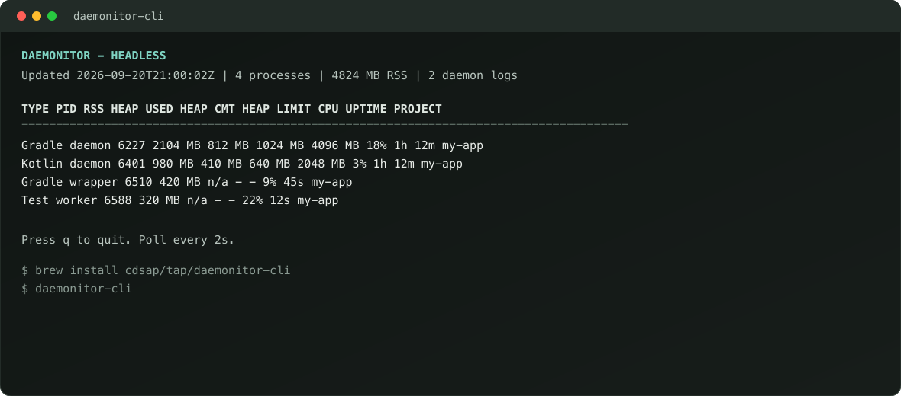

<p align="center">
  
</p>

# Daemonitor

> Activity Monitor for your Gradle daemons — what's building now, and what built recently.

Daemonitor watches the Gradle-related JVMs on your machine: daemons, wrappers, Kotlin daemons, and
test workers. Use the **desktop app** for a full Activity Monitor UI, or the **CLI** for the same
live view in a terminal (including over SSH).

Everything stays local. Command lines and logs are redacted before storage. The only outbound
network use is GitHub Releases update checks and installer downloads you approve.

[](https://github.com/cdsap/daemonitor/actions/workflows/ci.yml)


**Website:** <https://cdsap.github.io/daemonitor/> · **CLI options:** <https://cdsap.github.io/daemonitor/cli.html>

---

## Install

### Desktop app

Grab the installer for your OS from
[GitHub Releases](https://github.com/cdsap/daemonitor/releases/latest):

| OS | Installer | In-app update package |
|----|-----------|------------------------|
| macOS | `.dmg` | `.zip` app bundle |
| Windows | `.msi` | `.zip` app directory |
| Linux | `.deb` | `.tar.gz` standalone image |

Asset names include the CPU architecture (`x64` or `arm64`), for example
`Daemonitor-1.0.7-macos-arm64.dmg`. No project-local Gradle setup is required.

On Linux, prefer the `.deb` for installs and the `.tar.gz` for writable standalone updates. See
[Linux Update Distribution](docs/linux-update-distribution.md).

### CLI

```bash
brew tap cdsap/tap
brew trust cdsap/tap   # Homebrew 7+
brew install daemonitor-cli
daemonitor-cli
```

Needs JDK 21 (`openjdk@21` is installed as a Homebrew dependency). You can also download
`daemonitor-cli-*.zip` from [Releases](https://github.com/cdsap/daemonitor/releases/latest).

Full flag reference: [CLI options on the website](https://cdsap.github.io/daemonitor/cli.html).

---

## What you get

### Live Monitor (desktop)


- Gradle-related JVMs by type (daemon, wrapper, Kotlin daemon, test worker, other)
- RSS, live heap (when Attach/JMX works), CPU, and uptime
- Summary tiles, memory-pressure badges, and a detail panel with log tail
- Switch to terminal collection from the toolbar when you want a lighter footprint

First-poll CPU shows `…` / `sampling…` until a delta exists; `0%` means idle after that. Live heap
stays `n/a` for wrappers and test workers (daemons only). More detail:
[JVM heap collection](docs/jvm-heap-collection.md).

### CLI (terminal)



Same core monitor in your terminal — useful on build machines and over SSH:

```bash
daemonitor-cli
ssh -t build-machine daemonitor-cli
```

Press `q` to quit. Desktop and CLI share the same local database and retention settings. Packaged
desktop apps also accept `--headless` for a similar terminal mode.

### Visual


Rolling RSS / live-heap timelines with configured `-Xmx` when known. Click the legend to hide or
focus a series.

### Build history


Reconstructed builds with duration, peak RSS, status, source, and coding-agent attribution when
detectable. Filter by project and time range.

### MCP (optional)

A local, read-only MCP server so agent tools can inspect history and current processes — same
SQLite database, same redaction rules. Enable it in **Settings**, then paste the URL and token into
your MCP client. Details and examples:
[website](https://cdsap.github.io/daemonitor/#mcp) and the MCP section below.

---

## Quick start from source

```bash
./gradlew run                 # desktop app
./gradlew runHeadless         # terminal mode via the desktop module
./gradlew :cli:run --args="--help"
```

Standalone CLI without Compose:

```bash
./gradlew :cli:installDist
build/install/daemonitor-cli/bin/daemonitor-cli
```

Requires **JDK 17+** to run Gradle (the build uses a Java 21 toolchain). Daemonitor needs permission
to read your process list and Gradle daemon logs under `~/.gradle/daemon/<version>/`.

---

## Updates

At startup (and from Settings) Daemonitor checks GitHub Releases. When a newer version is available,
Settings shows `(1)`. After you approve a download it verifies the SHA-256 checksum, then stages
**Restart and Update** or opens the platform installer. It never installs silently while running.

---

## Connect MCP

1. Open **Daemonitor → Settings**
2. Enable MCP
3. Copy the local URL and token into your client

HTTP example:

```json
{
  "mcpServers": {
    "daemonitor": {
      "url": "http://127.0.0.1:17333/mcp",
      "headers": {
        "Authorization": "Bearer <token from Daemonitor Settings>"
      }
    }
  }
}
```

The server binds to `127.0.0.1` only. Keep Daemonitor open while connected. It is read-only.

For stdio clients, use the packaged launcher with `--mcp` (not `./gradlew run` — Gradle stdout
corrupts MCP messages):

```json
{
  "mcpServers": {
    "daemonitor": {
      "command": "/Applications/Daemonitor.app/Contents/MacOS/Daemonitor",
      "args": ["--mcp"]
    }
  }
}
```

Tools: `daemonitor_search_history`, `daemonitor_builds_for_process`,
`daemonitor_current_processes`.

---

## How it works

1. **Process polling** ([OSHI](https://github.com/oshi/oshi), every 2s) — RSS, CPU, uptime, JVM flags
2. **Daemon-log parsing** — build start/end, outcome, working directory, env-var *names* for
   source/agent attribution

Builds are reconstructed from a daemon's busy→idle window matched to samples in that window, then
stored in local SQLite and purged by retention (default 15 days, range 1–90). Lowering retention
deletes older rows and incrementally compacts the database.

| OS | Data directory |
|----|----------------|
| macOS | `~/Library/Application Support/Daemonitor` |
| Linux | `$XDG_DATA_HOME/Daemonitor` or `~/.local/share/Daemonitor` |
| Windows | `%LOCALAPPDATA%\Daemonitor` |

Contains `watcher.db` and `settings.properties`.

Agent attribution uses env-var names in the daemon log (never values). Known agents: Claude Code,
Cursor, Codex, Gemini CLI, Aider. Ambient variables from Daemonitor's own process are ignored.

---

## Develop

```bash
./gradlew test
./gradlew packageDmg   # macOS
./gradlew packageMsi   # Windows
./gradlew packageDeb   # Linux
```

Tag releases publish installers, `daemonitor-cli-*.zip`, `latest.json`, `update.json`, and
checksums. See [docs/update-metadata.md](docs/update-metadata.md).

Refresh desktop README screenshots after UI changes:

```bash
./gradlew captureReadmeScreenshots test
```

Review `docs/images/` before committing (synthetic samples only).

**Stack:** Kotlin · Compose for Desktop · OSHI · SQLDelight · Coroutines

**Privacy:** Local-only storage, redacted command lines/logs, owner-only database. Outbound traffic
is limited to GitHub Releases checks and downloads you approve.

**Status:** Early (v1.0.7). See `requirements.md` for the original spec.
