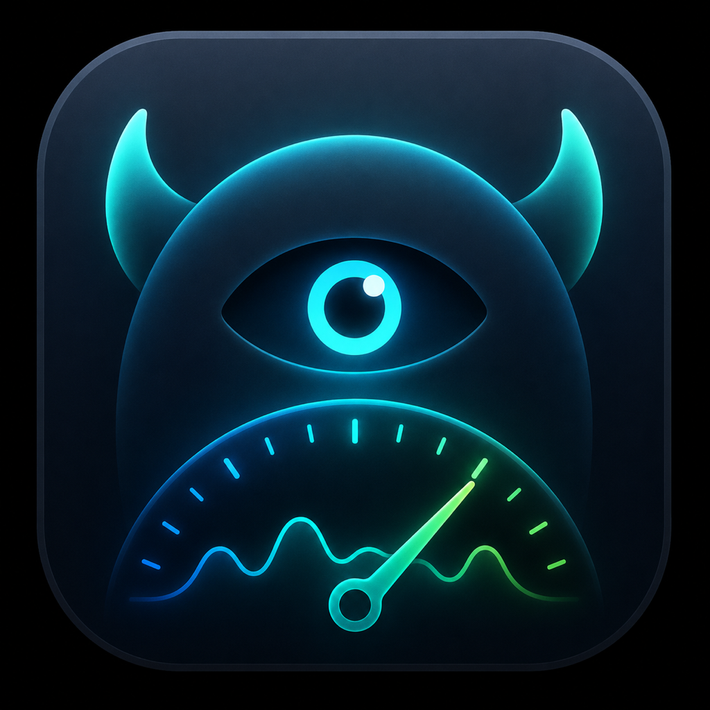

<p align="center">
  
</p>

# Daemonitor

> Activity Monitor for your Gradle daemons — see what's building right now, and what built recently.

Daemonitor is a local desktop app that shows the Gradle activity happening on your machine: which
daemons, wrappers, and test workers are running, how much memory and CPU they're using, the latest
daemon-log lines, and a searchable history of past builds — including **which AI coding agent
triggered each build**. It's built for the agentic-workflow era, where multiple IDEs, terminals, and
agents can all be driving Gradle at once.

Everything stays on your machine. No telemetry, no network calls; command lines and logs are
best-effort redacted before they're ever stored.

[](https://github.com/cdsap/daemonitor/actions/workflows/ci.yml)


---

## Features

### Live Monitor
- Every running Gradle-related JVM, classified by type with an at-a-glance icon:
  - 🐘 **Gradle daemon** · 🐘+🔧 **Gradle wrapper** · the **Kotlin** mark for the Kotlin daemon · 🧪 test worker · ☕ other Gradle-related JVM
- Per-process **RSS, CPU, and live-ticking uptime**
- Headline stats: active processes, total RSS, highest-memory PID, active projects
- Highlight badges: high/critical memory, `MULTI-BUILD` (a project with concurrent build invocations), `AUTOMATED` (CI/script/agent flags)
- Per-daemon detail with `-Xmx`, GC, working dir, full (redacted) command line, and a live tail of the daemon log

### Historical
- Every reconstructed build, with start time, project, duration, peak RSS, **status** (✓ success / ✗ failed / ⚠ interrupted / ◐ completed), **source** (terminal / IDE), and **agent**
- Filter by project and time range
- Per-build detail with resource peaks and a captured log excerpt

### Settings
- Configurable **history retention** (default **15 days**, range 1–90). Lowering it purges out-of-range entries immediately.

### AI-agent attribution
Daemonitor fingerprints the coding agent behind a build from the environment-variable *names* the
daemon recorded (names only — never values, staying within the redaction posture). It recognizes
Claude Code, Cursor, Codex, Gemini CLI, and Aider, and flags unrecognized agents explicitly.

It also **subtracts its own ambient environment** before attributing: if Daemonitor itself runs
inside, say, a Claude Code shell, every build would otherwise inherit those variables. Only signals
that distinguish a build from Daemonitor's own session are attributed, so you don't get "everything
is Claude."

---

## Requirements

- macOS, Linux, or Windows
- Permission to read your own process list and Gradle daemon logs

Daemonitor reads Gradle daemon logs under `~/.gradle/daemon/<version>/` and enumerates processes
owned by the current user.

## Install

Daemonitor is distributed as a native desktop app per operating system:

| OS | Package |
|----|---------|
| macOS | `.dmg` |
| Windows | `.msi` |
| Linux | `.deb` |

The installed app does not require a project-local Gradle setup. It only reads local process
metadata and Gradle daemon logs for the current user.

## Run from source

Source builds require **JDK 21** because the Kotlin build is pinned to a Java 21 toolchain.

```bash
./gradlew run
```

## Build a native distribution

The Compose Gradle plugin packages a platform-native installer via `jpackage` (must be built on the
target OS):

```bash
./gradlew packageDmg          # macOS (.dmg)
./gradlew packageMsi          # Windows (.msi)
./gradlew packageDeb          # Linux (.deb)
```

## Test

```bash
./gradlew test
```

The suite includes unit tests for the collection/classification/aggregation logic and **Compose UI
tests** that mount the real screens and assert on rendered nodes. CI runs the full suite on
**Linux, Windows, and macOS** (Linux uses a virtual display for the UI tests).

---

## How it works

Daemonitor combines two signals:

1. **Process polling** (via [OSHI](https://github.com/oshi/oshi)) every 2 s — RSS, CPU, uptime, and JVM flags for the current user's Gradle-related JVMs.
2. **Daemon-log parsing** — build *existence*, start/end, outcome, working directory, and the environment-variable names used for source/agent attribution.

A build is reconstructed by correlating a daemon's busy→idle bracket (which must contain a real build
start) with the resource samples taken inside that window. Confirmed builds and samples are persisted
to a local SQLite database (owner-only file permissions; excluded from Time Machine on macOS) and
purged by the configured retention window.

### Where data lives

| OS | Path |
|----|------|
| macOS | `~/Library/Application Support/Daemonitor` |
| Linux | `$XDG_DATA_HOME/Daemonitor` (or `~/.local/share/Daemonitor`) |
| Windows | `%LOCALAPPDATA%\Daemonitor` |

Holds `watcher.db` (history) and `settings.properties` (retention).

## Tech stack

Kotlin · Compose for Desktop (Material 3) · OSHI · SQLDelight + JDBC SQLite · Kotlin Coroutines.

## Privacy

All data is local. Command lines and daemon-log lines may contain sensitive values, so they are
redacted on a best-effort basis before storage, and the database file is created with owner-only
permissions. Daemonitor never makes network requests.

## Status

Early (v0.1.0). The data model and detection heuristics are evolving; see `requirements.md` for the
original specification.
