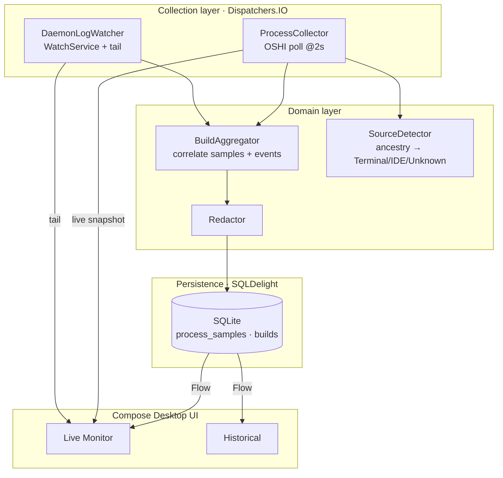

# feat: Gradle Process Watcher — Lean MVP

## Summary

A local, passive macOS desktop app (Kotlin + Compose Desktop) that observes Gradle activity on the developer's machine and answers two questions: *what Gradle is running right now*, and *what Gradle activity happened recently*. It combines two data sources — periodic OSHI process polling for live resource metrics, and parsing of Gradle daemon `.out.log` files for authoritative per-build boundaries — persisted to a local SQLite database via SQLDelight, and surfaced through a Live Monitor and a Historical view.

This plan targets the **lean MVP** scoped to the spec's Success Criteria. Charts, the full configuration surface, JVM heap detection, named-AI-agent attribution, and the larger alert set are explicitly deferred (see Scope Boundaries). The keystone decision — using daemon-log busy/idle brackets as the per-build event source rather than PID-keyed polling alone — resolves the most consequential finding from the requirements review (origin: `requirements.md`, Open Question "PID-keyed sessions conflate daemon lifetime with builds").

---

## Problem Frame

Agentic AI workflows, IDEs, terminals, and scripts can all trigger Gradle builds concurrently, making local build activity hard to track and occasionally resource-straining. The developer needs local visibility: which builds are running, which project each belongs to, how much memory Gradle is consuming, whether activity is unexpected, and what happened earlier today.

The hard technical constraint, surfaced in review, is that **a Gradle daemon is a long-lived process that serves many sequential builds**. Polling processes by PID therefore cannot, on its own, distinguish individual builds — it sees one long-lived daemon. The product's core questions ("which builds ran", "repeated agent builds") are per-build questions, so the architecture must derive build boundaries from a source that records every build: the daemon log. Polling supplies live resource metrics; log parsing supplies build identity and lifecycle. Neither alone is sufficient.

A second constraint is the macOS introspection boundary: command lines, working directories, and environment variables are only readable for same-UID processes, env is initial-only, and JVM heap of an external process is not observable without attaching. The MVP scopes data capture to what is reliably available (RSS, argv, cwd, parent PID, CPU delta) and treats the rest as best-effort or out of scope.

---

## Requirements Trace

The origin document (`requirements.md`) does not use R-IDs; requirements are traced to its Success Criteria and Goals by name. Each is mapped to the implementation unit that advances it.

| Origin requirement (success criterion / goal) | Advanced by |
|---|---|
| "What Gradle processes are running right now" | U2 (collector), U7 (Live Monitor) |
| "Which project each process belongs to" | U2 (cwd → project path), U7/U8 |
| "How much memory Gradle activity is consuming" | U2 (RSS + `-Xmx`), U5 (peak/avg), U7 |
| "Whether an AI agent or IDE is triggering unexpected builds" | U6 (source detection, best-effort), U9 (highlight: repeated builds) |
| "What happened earlier in the day" | U3 (build events), U5 (build records), U8 (Historical) |
| "Which daemon logs explain the latest Gradle behavior" | U3 (log tail + per-build snippet), U7/U8 (log panels) |
| Goal: which daemons are active / daemon restarts | U2 (daemon classification), U5 (daemon identity across PIDs) |
| Goal: latest daemon log lines | U3, U7 |
| Privacy: data stays local; sensitive-data disclosure in UI | U4 (file perms, redaction storage), U2/U3 (redaction), U9 (disclosure) |

---

## Key Technical Decisions

**KTD-1 · Build boundaries come from daemon-log parsing, not PID polling.** A *daemon* is PID-scoped; a *build* is a confirmed build segment within that daemon's lifetime. A busy→idle bracket (`Marking the daemon as busy` … `Marking the daemon as idle`) is only a *candidate* window — it is NOT 1:1 with a user build, because daemon expiration and health/cancel cycles also flip busy/idle (verified against a real log: 3 busy/idle pairs but only 2 build outcomes). A `Build` record is therefore emitted **only** when a positive build-start marker — `Starting Nth build in daemon` or `Daemon is about to start building Build{id=…}` — is observed inside the bracket; a bare bracket with no such marker is non-build daemon activity and is discarded. The outcome line `BUILD SUCCESSFUL|FAILED in <dur>` is captured as *optional enrichment* of the open window when present (it is sometimes relayed only to the client and absent from the daemon log); `final_status` defaults to `completed-no-outcome` when the bracket closes without one. This resolves the review's keystone finding. (See origin: `requirements.md` Deferred / Open Questions, "PID-keyed sessions conflate daemon lifetime with builds".)

**KTD-2 · Live resource metrics come from OSHI polling; the two streams are correlated by time + PID.** Poll every 2s (hard-coded default) for RSS, CPU delta, state, parent PID, start time. Per-build resource peaks are computed from poll samples whose timestamps fall inside a build's log-bracketed window. This is coarse at 2s granularity, and (verified against real logs) **sub-poll builds are the expected majority** for fast/incremental/no-op builds — ~44% completed sub-second in one sampled daemon — not an edge case. Such builds have null resource peaks; the UI renders them as "not sampled" (U8) and excludes them from memory highlighting (U9). Build *existence and outcome* still come from the log, so these builds are never missed — only their fine-grained resource peaks are unavailable.

**KTD-3 · RSS-only memory; `-Xmx`/`-Xms`/GC parsed from argv.** External-JVM heap is not observable without JMX/attach, which conflicts with the passive-observer non-goal. `max_heap_mb` is derived from a parsed `-Xmx` when present and is otherwise null. Heap occupancy and "near memory limit" alerts are deferred.

**KTD-4 · CPU is delta-sampled, never lifetime-averaged.** Use `OSProcess.getProcessCpuLoadBetweenTicks(priorSnapshot)` across consecutive polls (not `ps %cpu` / `getProcessCpuLoadCumulative`, which are lifetime averages). The collector retains the prior snapshot per PID.

**KTD-5 · Persistence via SQLDelight 2.x.** Compile-time-checked queries and `Flow`-based reactive reads drive the polling UI without a hand-rolled observation layer. Two tables (`process_samples`, `builds`) — the spec's third `daemon_logs` table is collapsed into a per-build log snippet column and live-from-disk tailing (deferred as a standalone table). The DB file is created `chmod 600`; stale rows are purged on startup by retention window (7 days, hard-coded).

**KTD-6 · Scanning is scoped to the current user's processes.** Effective-UID match only; no elevated privileges requested. This is both a feasibility fact (cwd/argv/env only work same-UID) and a security control (avoids becoming a cross-user credential-reading target).

**KTD-7 · Secrets are redacted before persistence.** Command lines and log lines pass a redaction filter (denylist of secret-shaped keys in `-P<key>=`, `-D<key>=`, **and `--<key>=`** forms — `password`, `token`, `secret`, `key`, `apiKey`, `credential` — plus `://user:pass@` URL forms) before they are written to SQLite **or displayed**. Redaction runs *inside* `DaemonLogWatcher` and the collector, so the live log tail (U7) and the live process snapshot are fed from already-redacted strings; `WatcherDatabase` insert methods accept only pre-redacted `command_line`/`log_snippet` values as an enforced contract (noted in the schema). Environment variables are captured as *names only*, never values. Positional/bare-argument secrets (a secret passed as a value with no recognizable key) are not caught by the denylist — documented as residual risk.

**KTD-8 · Source attribution is derived primarily from the daemon log, not live process polling.** Each build's busy bracket contains an `EstablishBuildEnvironment` line listing the build's environment-variable *names* (verified to include `TERM_PROGRAM`, and agent markers such as `CLAUDECODE` / `AI_AGENT` / `CLAUDE_CODE_ENTRYPOINT` when present) plus the build `currentDir` — both build-correlated by construction and name-only (KTD-7-safe). v1 maps these to `Terminal` / `IDE` / `Unknown` (binary resolved-or-`Unknown`, no intermediate confidence tier). Live parent-process ancestry of the connecting `gradlew`/Tooling-API launcher is a *secondary enrichment only*, because that launcher is frequently gone between 2s polls. When neither signal resolves, the source is `Unknown` — never guessed. Named-agent attribution (Claude Code, Codex) stays deferred, but the env-name signal makes it cheap to add later. (This replaces the original poll-the-launcher approach, which the review showed would resolve to `Unknown` for exactly the agent/IDE builds the product most wants to attribute.)

**KTD-9 · No configuration UI in v1.** All settings (2s poll, 100 log-tail lines, 7-day retention, 4 GB warn / 8 GB critical thresholds) are hard-coded constants in a single `Defaults` object. The configuration surface is deferred.

---

## High-Level Technical Design

### Component architecture



### Build-detection state machine (per daemon PID)

The aggregator tracks each daemon as a state machine driven by log markers. A single emit happens when the bracket closes (idle marker or PID loss); the build-start marker *qualifies* the bracket as a real build, and the outcome line is optional enrichment of the open window — never its own state that could swallow the next bracket's idle. This is directional guidance for the aggregation logic, not an implementation spec.

```mermaid
stateDiagram-v2
    [*] --> Idle: daemon PID + log file found
    Idle --> Busy: "Marking the daemon as busy" (candidate window opens)
    Busy --> Building: "Starting Nth build in daemon" / "Build{id=…}" (qualifies as real build)
    Busy --> Idle: "Marking the daemon as idle" with NO build-start marker (discard — non-build activity)
    Building --> Building: "BUILD SUCCESSFUL/FAILED in <dur>" (enrich open window with outcome, optional)
    Building --> Idle: "Marking the daemon as idle" (emit Build; final_status=outcome or completed-no-outcome)
    Idle --> [*]: PID disappears (close daemon lifetime)
    Building --> [*]: PID disappears mid-build (emit Build, final_status=interrupted)
```

Daemon identity (modeled now for future restart detection, which is a deferred alert): keyed on the daemon's **own** context — the `uid` / `javaHome` / `daemonOpts` tuple from the `DefaultDaemonContext[…]` line in the log — **not** the project path, because one daemon legitimately serves builds for many projects over its lifetime. Project path is a per-build attribute, not part of daemon identity. PID reuse is disambiguated by `PID + start_time`.

---

## Output Structure

```text
gradle_watcher/
├── build.gradle.kts
├── settings.gradle.kts
├── gradle/
│   └── wrapper/
└── src/
    ├── main/
    │   ├── kotlin/com/gradlewatcher/
    │   │   ├── Main.kt
    │   │   ├── Defaults.kt
    │   │   ├── collect/
    │   │   │   ├── ProcessCollector.kt
    │   │   │   ├── GradleProcessClassifier.kt
    │   │   │   ├── JvmArgParser.kt
    │   │   │   └── DaemonLogWatcher.kt
    │   │   ├── domain/
    │   │   │   ├── model/        # GradleProcess, Build, DaemonState, Source
    │   │   │   ├── BuildAggregator.kt
    │   │   │   ├── SourceDetector.kt
    │   │   │   └── Redactor.kt
    │   │   ├── store/
    │   │   │   └── WatcherDatabase.kt   # SQLDelight driver + purge + perms
    │   │   └── ui/
    │   │       ├── live/        # LiveMonitorScreen, ProcessTable, DetailPanel, LogTailPanel
    │   │       ├── history/     # HistoryScreen, BuildTable, Filters
    │   │       └── common/      # AppScaffold (tabs), Badges, PrivacyNotice, EmptyState
    │   └── sqldelight/com/gradlewatcher/store/
    │       └── Watcher.sq
    └── test/
        └── kotlin/com/gradlewatcher/
            ├── collect/
            ├── domain/
            └── store/
```

The tree is a scope declaration, not a constraint; per-unit `**Files:**` are authoritative.

---

## Implementation Units

> **Path convention:** within a unit's **Files**, the first path of a group is written in full from the repo root; subsequent shorthand paths (`collect/…`, `domain/…`, `ui/…`, `model/…`) are implicitly rooted at `src/main/kotlin/com/gradlewatcher/` (tests at `src/test/kotlin/com/gradlewatcher/`). All paths are repo-relative.

### Phase 1 — Foundation

### U1. Project scaffold and dependencies

- **Goal:** A buildable Compose Desktop app skeleton with all MVP dependencies wired and a launchable empty window.
- **Requirements:** Frontend (Kotlin + Compose Desktop); enables all subsequent units.
- **Dependencies:** none.
- **Files:** `build.gradle.kts`, `settings.gradle.kts`, `gradle/wrapper/*`, `src/main/kotlin/com/gradlewatcher/Main.kt`, `src/main/kotlin/com/gradlewatcher/Defaults.kt`.
- **Approach:** Kotlin/JVM + `org.jetbrains.compose` plugin; dependencies: `oshi-core`, `app.cash.sqldelight` (gradle plugin + `sqlite-driver` + `coroutines-extensions` + explicit `sqlite-dialect`), kotlinx-coroutines. **Pin a known-compatible version matrix as the first task** — the Compose Gradle plugin and the SQLDelight 2.x plugin each pin a Kotlin compiler range, and a Kotlin mismatch between them is the classic first-build failure for this stack; confirm the Compose plugin's required Kotlin matches SQLDelight's supported Kotlin before any other unit starts (suggested: Kotlin + matching `org.jetbrains.compose` 1.7.x, SQLDelight 2.1.x, oshi-core 6.x — verify the exact triple at implementation time). Configure the SQLDelight `databases {}` block with `packageName` and the dialect dependency (the common setup pitfall per research). `Defaults.kt` holds hard-coded constants (KTD-9): `POLL_INTERVAL = 2.s`, `LOG_TAIL_LINES = 100`, `RETENTION_DAYS = 7`, `MEM_WARN_MB = 4096`, `MEM_CRIT_MB = 8192`, `GRADLE_USER_HOME` (default `~/.gradle`).
- **Patterns to follow:** Compose Desktop `application { Window { } }` entry point.
- **Test scenarios:** `Test expectation: none — scaffolding; verification is that the module assembles and the window launches.`
- **Verification:** `./gradlew run` opens an empty window; `./gradlew build` succeeds.

---

### Phase 2 — Data collection and domain

### U2. Process collector (OSHI)

- **Goal:** Enumerate current-user processes each poll, classify Gradle-related ones, and capture their metrics into an immutable snapshot.
- **Requirements:** "What's running now", "which project", "how much memory"; Data Collection section.
- **Dependencies:** U1.
- **Files:** `src/main/kotlin/com/gradlewatcher/collect/ProcessCollector.kt`, `collect/GradleProcessClassifier.kt`, `collect/JvmArgParser.kt`, `domain/model/GradleProcess.kt`, `domain/Redactor.kt`; tests `src/test/kotlin/com/gradlewatcher/collect/GradleProcessClassifierTest.kt`, `collect/JvmArgParserTest.kt`, `domain/RedactorTest.kt`, `collect/ProcessCollectorTest.kt`.
- **Approach:** Filter to effective-UID match (KTD-6). Classify by command line / main class into `GradleDaemon` (`org.gradle.launcher.daemon`/`GradleDaemon`), `GradleWrapper` (`gradlew`/`org.gradle.wrapper`), `KotlinDaemon`, `TestWorker` (`worker.org.gradle.process`), or `JavaGradleRelated`. Capture PID, PPID, start time, RSS, state via OSHI; CPU via `getProcessCpuLoadBetweenTicks` against the retained prior snapshot per PID (KTD-4); cwd and argv best-effort same-UID. Parse `-Xmx`/`-Xms`/GC flags and daemon flags from argv (`JvmArgParser`). Derive project path from cwd. Run `Redactor` over the command line before it leaves the collector (KTD-7).
- **Patterns to follow:** OSHI `OperatingSystem.getProcesses()` + per-PID prior-snapshot map held in the collector.
- **Test scenarios:**
  - Classifier: a daemon command line → `GradleDaemon`; a `gradlew` line → `GradleWrapper`; a Kotlin daemon line → `KotlinDaemon`; a test-worker line → `TestWorker`; an unrelated `java` line → not collected.
  - `JvmArgParser`: `-Xmx4g -Xms512m -XX:+UseG1GC` → maxHeapMb=4096, minHeapMb=512, gc="G1"; absent `-Xmx` → maxHeapMb=null.
  - CPU: two snapshots with known tick deltas → expected 0–100% normalized by logical-processor count; single snapshot (no prior) → cpu=null, not a lifetime average.
  - Redactor: `-Psigning.password=abc -Dtoken=xyz` → both values masked; `--info` and `-PsafeFlag=ok` → unchanged; `https://user:pw@repo` → credentials masked.
  - Current-user scoping: a process owned by another UID present in OSHI output → excluded.
- **Verification:** Running real Gradle daemons appear with correct type, RSS, and non-null CPU after the second poll; argv-sourced `-Xmx` shows in the snapshot.

### U3. Daemon log discovery, tailing, and build-event parsing

- **Goal:** Locate each live daemon's log, tail the last N lines for display, and parse build-lifecycle markers into a stream of `BuildEvent`s.
- **Requirements:** "Which daemon logs explain latest behavior", "latest daemon log lines", build start/end times.
- **Dependencies:** U1 (U2 for PID liveness cross-check, but parser is testable standalone).
- **Files:** `src/main/kotlin/com/gradlewatcher/collect/DaemonLogWatcher.kt`, `domain/model/BuildEvent.kt`; tests `src/test/kotlin/com/gradlewatcher/collect/DaemonLogParserTest.kt` (+ fixture logs under `src/test/resources/daemon-logs/`).
- **Approach:** Map a daemon PID to its log via the filename `~/.gradle/daemon/*/daemon-<pid>.out.log` (the directory segment yields the Gradle version). Use a `java.nio.file.WatchService` on the daemon dirs plus incremental reads from a retained byte offset per file (cheaper than re-tailing); note macOS has no native FSEvents backend for `WatchService` (polling fallback, multi-second latency) and newly created version subdirs need a periodic rescan to register. Parse with **two grammars** (real logs confirm the outcome line differs structurally from marker lines): (a) prefixed marker lines of shape `<ISO-ts> [<LEVEL>] [<class>] <msg>` → `BusyMark` (`Marking the daemon as busy`), `IdleMark` (`Marking the daemon as idle`), `BuildStart` (`Starting Nth build in daemon` / `Daemon is about to start building Build{id=…}`), `DaemonContext` (`DefaultDaemonContext[uid=…,javaHome=…,daemonOpts=…]`), `BuildEnv` (`EstablishBuildEnvironment … Configuring env variables: [<names>]`); (b) a **prefix-agnostic** regex `^BUILD (SUCCESSFUL|FAILED) in (.+)$` for the outcome line (it has NO ts/level/class prefix). Parse durations in all observed shapes: `<n>ms`, `<n>s`, `<n>m <n>s`, `<n>m`. Extract `currentDir` and the env-var **name** list from the `BuildStart`/`BuildEnv` lines for source detection (U6). Detect ERROR/WARN lines for the per-build snippet. Redact each line (KTD-7) **before** it enters the tail buffer or is exposed (Redactor is a dependency of this unit). Keep only the last `LOG_TAIL_LINES` for the live tail.
- **Patterns to follow:** offset-based incremental file reads; WatchService registered on each version subdirectory + periodic rescan.
- **Test scenarios:** *(author fixtures from a real `daemon-*.out.log`, not a synthesized one)*
  - Fixture with one qualified build (busy + `Starting build` + outcome + idle) → emits `BuildStart`, `Outcome`, `IdleMark` for one build with correct timestamps.
  - **Bracket with busy→idle but no build-start marker → emits NO build** (non-build daemon activity, e.g. expiration cycle). *Covers keystone phantom-build defect.*
  - Fixture with three busy/idle pairs but only two build-start markers → exactly two builds.
  - Outcome line `BUILD SUCCESSFUL in 7s` with no `[LEVEL]` prefix → parsed via the prefix-agnostic regex (a prefix-requiring parser must NOT be assumed).
  - Build whose bracket closes with no outcome line → build emitted, outcome absent (drives `completed-no-outcome` in U5).
  - Duration parsing: `280ms` → 0.28s; `7s` → 7s; `1m 2s` → 62s; bare `2m` → 120s.
  - Source extraction: a `BuildEnv` line listing `CLAUDECODE, TERM_PROGRAM` → env-name set captured; `currentDir=/x/y` → captured.
  - Redaction: a log line containing `-Ptoken=xyz` → masked before it reaches the tail buffer.
  - PID→log mapping: given a daemon dir tree, PID 123 under `8.9/` → resolves path and version `8.9`.
- **Verification:** Against a real `~/.gradle/daemon` tree, exactly one build emits per real invocation (no phantom builds from expiration cycles), outcomes parse from the bare line, and the tail panel shows redacted recent lines.

### U4. Persistence layer (SQLDelight)

- **Goal:** Define the schema, open a permission-restricted database, expose Flow-based reads, and purge stale data on startup.
- **Requirements:** Data Storage; Privacy (local, restricted).
- **Dependencies:** U1.
- **Files:** `src/main/sqldelight/com/gradlewatcher/store/Watcher.sq`, `src/main/kotlin/com/gradlewatcher/store/WatcherDatabase.kt`; tests `src/test/kotlin/com/gradlewatcher/store/WatcherDatabaseTest.kt`.
- **Approach:** Tables (KTD-5): `process_samples` (id, timestamp, pid, parent_pid, process_type, command_line, working_directory, project_path, cpu_percent, rss_memory_mb, max_heap_mb, status) and `builds` (build_id, daemon_pid, **daemon_identity**, process_type, command_line, working_directory, project_path, start_time, end_time, duration_seconds, peak_memory_mb, avg_memory_mb, peak_cpu_percent, inferred_source, final_status, log_snippet). `daemon_identity` is a flat string column (the daemon-context tuple from KTD/HTD) populated by U5 — defined here so U4 can be implemented before U5 without a later migration. `inferred_source` defaults to `'unknown'` and is nullable so persistence doesn't block on source detection. Peak columns are nullable; null encodes a sub-poll build (no separate flag — KTD-2). DB at `~/Library/Application Support/GradleWatcher/watcher.db`; create the parent dir and set the file to mode 600 on first open, **and set the Time Machine exclusion xattr** (`com.apple.metadata:com_apple_backup_excludeItem = com.apple.backupd`) on the directory so 7 days of redacted-but-unencrypted data is not copied to backup volumes (KTD-7/Privacy). **Redaction invariant:** `insertProcessSample`/`insertBuild` accept only pre-redacted `command_line`/`log_snippet` strings; document this contract as a column comment in `Watcher.sq`. On startup, delete `process_samples`/`builds` rows older than `RETENTION_DAYS` (KTD-5). Provide a `JdbcSqliteDriver` and a `Database` instance; expose query methods returning `Flow` via `coroutines-extensions`.
- **Patterns to follow:** SQLDelight `.sq` query definitions; `JdbcSqliteDriver("jdbc:sqlite:<path>")` + `Schema.create`.
- **Test scenarios:**
  - Insert a sample and a build, read back via the generated query → fields round-trip, including null `max_heap_mb` and default `inferred_source='unknown'`.
  - Purge: seed rows dated 8 days ago and 1 day ago, run startup purge → only the recent row remains.
  - File permissions: after first open, the DB file mode is 600 (POSIX check; skip assertion gracefully on non-POSIX).
  - `Flow` query emits an updated list after a new insert.
- **Verification:** App run twice retains recent builds and drops > 7-day-old rows; DB file is owner-only.

### U5. Build/session aggregation engine

- **Goal:** Correlate poll samples (U2) and build events (U3) into per-build records and daemon-lifetime tracking, computing in-window resource peaks.
- **Requirements:** "What happened earlier today", build duration/peak memory, daemon-restart identity; resolves keystone F1.
- **Dependencies:** U2, U3, U4.
- **Files:** `src/main/kotlin/com/gradlewatcher/domain/BuildAggregator.kt`, `domain/model/Build.kt`, `domain/model/DaemonState.kt`; depends on `domain/Redactor.kt`; tests `src/test/kotlin/com/gradlewatcher/domain/BuildAggregatorTest.kt`.
- **Approach:** Maintain per-daemon-PID state per the state machine in HTD. A candidate window opens on `BusyMark` but a `Build` is emitted **only if** a `BuildStart` marker was seen inside it (KTD-1 — discard bare busy/idle brackets as non-build activity). On close (`IdleMark` or PID-disappearance) emit a `Build` with start/end/duration, `peak_memory_mb` / `avg_memory_mb` / `peak_cpu_percent` computed from `process_samples` whose timestamp falls in the window, `final_status` = the captured outcome, or `completed-no-outcome` when the bracket closed with no outcome line, or `interrupted` if the PID vanished mid-build. Bind any outcome line to the *currently open* window only (its timestamp must fall after this build's busy mark). Assign `daemon_identity` from the `DefaultDaemonContext` tuple (`uid`/`javaHome`/`daemonOpts`), **not** project path (HTD). Store the redacted log snippet for the window; if a path bypasses U2/U3 redaction, U5 redacts via its `Redactor` dependency before persisting (defense in depth). A zero-sample window records null peaks — the null *is* the sub-poll signal; no separate flag. Persist via U4. Restart detection is **not** built in this unit (deferred alert) — `daemon_identity` is merely stored for future use.
- **Execution note:** Implement this unit test-first — it carries the keystone logic and the highest correctness risk.
- **Test scenarios:**
  - Qualified build (busy + build-start + 3 in-window samples + idle) → one `Build`, peak = max RSS, avg = mean, duration from timestamps.
  - Two sequential qualified builds on one daemon PID → two distinct `Build` records (not one daemon-spanning record). *Covers the keystone fix.*
  - **Busy→idle bracket with no build-start marker → no `Build` emitted** (phantom-build guard).
  - Bracket closes with no outcome line → `Build` with `final_status='completed-no-outcome'`.
  - PID disappears mid-build → `Build` with `final_status='interrupted'`.
  - Zero in-window samples → `Build` with null peaks (sub-poll), no flag field.
  - `Outcome(FAILED)` within the open window → `final_status='failed'`; an outcome line arriving after idle is NOT attributed to the closed build.
  - One daemon PID serving two different project paths → one `daemon_identity` (context-keyed), two builds with different `project_path`.
- **Verification:** Running several real builds against one daemon produces one row per build with plausible durations/peaks, no phantom rows from expiration cycles, and a single stable `daemon_identity` even across projects.

### U6. Source detection

- **Goal:** Resolve each build's source to `Terminal`, `IDE`, or `Unknown` — primarily from the per-build daemon-log signal (KTD-8), with live ancestry as a fallback.
- **Requirements:** "Whether an AI agent or IDE is triggering builds" (best-effort); Source Detection section.
- **Dependencies:** U3 (per-build env-name list + `currentDir`), U2 (live ancestry, secondary).
- **Files:** `src/main/kotlin/com/gradlewatcher/domain/SourceDetector.kt`, `domain/model/Source.kt`; tests `src/test/kotlin/com/gradlewatcher/domain/SourceDetectorTest.kt`.
- **Approach:** **Primary signal (log-derived, KTD-8):** map the build's environment-variable *name* set from the `BuildEnv` line — `TERM_PROGRAM` (and shell markers) → `Terminal`; `TERMINAL_EMULATOR`/IDE markers (`__INTELLIJ_*`, `VSCODE_*`, `CURSOR_*`) → `IDE`. **Secondary fallback:** if the log signal is inconclusive and a `gradlew`/Tooling-API launcher was captured live (U2), walk its parent-process ancestry (shells → `Terminal`; `idea`/`studio`/`code`/`cursor` → `IDE`). Resolve to a single value; **binary outcome — resolved or `Unknown`, no intermediate confidence tier** (scope-trimmed per review). Never guess a non-`Unknown` source without a positive marker. (The env-name set also contains agent markers like `CLAUDECODE`; named-agent attribution is deferred but trivially layerable here later.)
- **Test scenarios:**
  - Build env-name set includes `TERM_PROGRAM` and a shell marker → `Terminal`.
  - Build env-name set includes an IntelliJ/VS Code marker → `IDE`.
  - Inconclusive log signal + live launcher whose ancestry includes `zsh` → `Terminal` (fallback path).
  - Neither log markers nor a captured launcher → `Unknown` (never guessed).
- **Verification:** Terminal-launched and IDE-launched builds attribute correctly from the log even when the launcher exited before any poll; detached/unknowable cases show `Unknown` rather than a wrong guess.

---

### Phase 3 — UI

### U7. Live Monitor screen

- **Goal:** Show currently running Gradle processes with a summary header, a process table, a detail panel, and a daemon-log tail panel, refreshed by a polling coroutine.
- **Requirements:** UI Requirements → Live Monitor Screen.
- **Dependencies:** U2, U3, U5; navigation shell.
- **Files:** `src/main/kotlin/com/gradlewatcher/ui/common/AppScaffold.kt`, `ui/common/EmptyState.kt`, `ui/live/LiveMonitorScreen.kt`, `ui/live/ProcessTable.kt`, `ui/live/DetailPanel.kt`, `ui/live/LogTailPanel.kt`, `ui/live/LiveViewModel.kt`; tests `src/test/kotlin/com/gradlewatcher/ui/live/LiveViewModelTest.kt`.
- **Approach:** Tab-based navigation (`AppScaffold` with Live / Historical tabs — resolves the design-review navigation gap). A polling coroutine in the ViewModel runs on `Dispatchers.IO` (`while(isActive){ poll(); delay(POLL_INTERVAL) }`), pushing state to the UI thread. Layout: `Row { ProcessTable (primary columns: type, project, duration, RSS, CPU, source) ; DetailPanel }` with secondary fields (full command line, working dir, JVM args, last log lines) in the detail panel — resolves the column-density finding. **Detail-panel states (all three specified):** (a) *No selection* — processes present, none clicked: panel shows a "Select a process to see details" prompt at fixed width (not collapsed, not auto-selected). (b) *Selected* — full fields. (c) *Process ended* — when the selected PID is absent on the next poll, show the last-captured snapshot (PID, type, project, RSS at exit, duration) under a "Process ended" label with timestamp, plus a dismiss affordance back to no-selection; the `LogTailPanel` freezes (stops updating, retains last lines). Row click selects; clicking empty space clears selection. **LogTailPanel scroll model:** default pin-to-bottom (auto-scroll on each new line); when the user scrolls up, switch to manual-review mode (stop auto-scroll) with a visible "Resume" affordance; auto-resume on process-selection change. **Unknown-source rendering:** in both tables `Unknown` renders as a muted dash/label (visually lighter than resolved `Terminal`/`IDE`), with a hover tooltip stating why ("source not determined"). **Permission-degraded rows:** only `working_directory`/`project_path`/`source` cells render as "—" when same-UID reads fail; PID/type/RSS/CPU always have values; a small lock icon + tooltip explains the partial data, and the row's detail panel still opens. Summary header: active process count, total RSS, highest-memory process, active project count. Explicit empty state when no Gradle processes are running.
- **Test scenarios (ViewModel-level):**
  - Poll returns 3 processes → state exposes 3 rows and a header with correct counts/total RSS.
  - Selecting a PID then that PID absent on next poll → detail state transitions to `ProcessEnded`.
  - Poll returns 0 processes → `EmptyState` flag true; header counts are zero (not blank).
  - Same-UID read failure on a process → row marked `permission-degraded`, app does not crash.
- **Verification:** With real builds running, the table updates every 2s, selection drives the detail and log panels, and an idle machine shows the empty state.

### U8. Historical screen

- **Goal:** Show past builds in a filterable table with a detail panel, satisfying "what happened earlier today".
- **Requirements:** UI Requirements → Historical Screen; "Simple filters by project and time range" (MVP scope).
- **Dependencies:** U4, U5; U7 scaffold.
- **Files:** `src/main/kotlin/com/gradlewatcher/ui/history/HistoryScreen.kt`, `ui/history/BuildTable.kt`, `ui/history/Filters.kt`, `ui/history/HistoryDetailPanel.kt`, `ui/history/HistoryViewModel.kt`; tests `src/test/kotlin/com/gradlewatcher/ui/history/HistoryViewModelTest.kt`.
- **Approach:** Read `builds` via SQLDelight `Flow`. Filters scoped to MVP: project (dropdown of seen projects) and time range with presets `Today` / `Last 24 hours` (other presets, and the process-type filter, are deferred — see Scope Boundaries). Filters apply live (on-change) and compound with AND. Build table columns: start time, project, duration, peak RSS, final status, source (Unknown rendered muted, per U7). Sub-poll builds render null peaks as "not sampled (<2s)" rather than a blank cell. Row click → `HistoryDetailPanel` (full command line, working dir, peak/avg memory, peak CPU, source, final status, log snippet). The log snippet renders in a fixed-height scrollable monospace block reusing U7's log-rendering component, labeled "Build log excerpt — lines captured during build window"; when the snippet is null/empty (sub-poll build), show "No log captured for this build window". Explicit empty-result state when no builds match.
- **Test scenarios (ViewModel-level):**
  - Seed builds across two projects → project filter narrows to the selected project's rows.
  - `Today` preset with a build dated yesterday and one today → only today's build shown.
  - Project + `Today` combined → AND semantics (both must match).
  - No matching rows → empty-result state flag set.
- **Verification:** After running builds, they appear in Historical; filters narrow correctly; selecting a build shows its per-build detail and log snippet.

### U9. Highlighting and privacy disclosure

- **Goal:** Visually flag the two MVP-scoped suspicious conditions and make the sensitive-data nature of the app clear in the UI.
- **Requirements:** Alerts and Highlighting (lean subset); Privacy.
- **Dependencies:** U5, U7, U8.
- **Files:** `src/main/kotlin/com/gradlewatcher/ui/common/Badges.kt` (badge composables + the two inline rule functions — no separate domain abstraction), `ui/common/PrivacyNotice.kt`; integration into `ProcessTable`/`BuildTable`; tests `src/test/kotlin/com/gradlewatcher/ui/common/BadgesTest.kt`.
- **Approach:** Two highlight rules (KTD-9 thresholds), inlined as functions in `Badges.kt` rather than a dedicated `HighlightRules` class (only two hard-coded rules, no runtime config — the abstraction would not earn its keep): (a) a process whose RSS exceeds `MEM_WARN_MB` (warn) / `MEM_CRIT_MB` (critical) → colored badge on the row (sub-poll builds with null RSS are excluded — they cannot trigger this); (b) multiple concurrent builds for the same project path → badge on those rows. Rule (b) applies to the **live `ProcessTable` only**, where concurrency is observable in real time; the Historical `BuildTable` does not show this badge (point-in-time concurrency is not a property of a single completed row). Badges auto-clear when the condition no longer holds on the next poll (resolves the badge-lifecycle gap — derived state, not sticky notifications). A persistent, unobtrusive footer on screens showing command lines/logs states that captured data may contain sensitive information and stays local (resolves the privacy-disclosure placement gap). Make the suspicious-activity signal visually prominent and keep `source` a first-class column (resolves the AI-slop/information-hierarchy finding).
- **Test scenarios:**
  - RSS just below `MEM_WARN_MB` → no badge; at/above warn → warn badge; at/above crit → critical badge.
  - Sub-poll build with null RSS → no memory badge (not treated as zero).
  - Two active builds with the same project path → both flagged; different projects → not flagged.
  - Condition clears on next poll → badge state recomputed to none (no sticky residue).
- **Verification:** A high-memory daemon and two same-project builds visibly highlight; the privacy footer is present wherever command lines/logs render.

---

## Scope Boundaries

### In scope (v1)
Process scanning (current-user), daemon-log-driven per-build detection, RSS + parsed `-Xmx`, delta CPU, SQLite persistence with restricted permissions and startup purge, secret redaction, Terminal/IDE/Unknown source attribution, Live Monitor, Historical table with project + time filters, two highlight conditions, privacy disclosure.

### Deferred to Follow-Up Work
- JVM heap / max-heap occupancy via JMX/attach and heap-based alerts.
- ~~Named-AI-agent attribution (Claude Code, Codex, VS Code/Cursor)~~ — **shipped**: `AgentDetector` fingerprints the agent and LLM provider from the daemon-log env-var names (Claude Code→Anthropic confirmed from real logs), persisted on each `Build` and shown in the Historical view. The AI-agent *filter preset* is still deferred.
- The full alert set (daemon restart, long-running, repeated agent builds, Kotlin daemon memory, test-worker limit) beyond the two shipped conditions.
- Configuration UI and the 8-option settings surface (defaults hard-coded in v1).
- Timeline chart and per-process/per-session memory & CPU trend charts.
- Standalone `daemon_logs` table with structured error/warning parsing (collapsed into a per-build snippet for v1).
- The extra Historical filter presets (high-memory, long-running, unknown-source, AI-agent) **and the process-type filter** (v1 filters on project + time range only).
- Cross-PID daemon-restart detection (the `daemon_identity` value is stored in v1, but the restart-detection logic and alert are deferred).
- Per-build automation attribution. Gradle 9.6's `--non-interactive` flag (and `--console=plain`) is detected on live launcher/wrapper command lines and badged "AUTOMATED" in the Live Monitor (U2/U9). Threading this into the per-build `Source` record is deferred — the flag is not in the daemon log (only the launcher command line), so it needs the same launcher↔build correlation as named-agent detection.
- SQLCipher database encryption (file-permission restriction + Time Machine backup exclusion only in v1).

### Out of scope (product non-goals, from origin)
Modifying Gradle builds; stopping/restarting daemons; uploading to Develocity or any remote service; deep task-level analysis; Build Scan parsing; team-wide reporting; Linux support; CLI mode.

---

## Risks & Dependencies

- **Phantom builds from non-build busy/idle cycles.** Verified real risk: daemon expiration/health cycles flip busy/idle without a build. Mitigation: emit a `Build` only when a positive build-start marker is seen inside the bracket (KTD-1, U3/U5 guard).
- **Daemon-log marker format and drift.** The busy/idle markers are prefixed structured lines but the `BUILD SUCCESSFUL/FAILED` outcome line is a bare, unprefixed line (verified) — parsing uses two grammars (U3). Marker strings live in one place (`DaemonLogWatcher`) for easy update. 9.x marker stability rests on research/docs; not yet verified against a local 9.x log — flagged for first-run validation.
- **2s polling misses short builds for resource peaks.** Accepted and surfaced: sub-poll builds are the *majority*; their peaks are null and render as "not sampled" (U8) and are excluded from memory highlighting (U9). Build *existence/outcome/source* still come from the log (never missed); only fine-grained resource peaks are coarse.
- **macOS read restrictions** (cwd/argv/env same-UID, env initial-only, open-file paths need `lsof`). Mitigation: current-user scoping is a design invariant (KTD-6); degraded fields render as "unavailable" (U7) rather than failing. Source detection no longer depends on catching the live launcher (KTD-8 log-derived), removing the prior timing-race risk.
- **Redaction is best-effort.** Regex denylist catches `-P`/`-D`/`--key=` and credentialed URLs but not positional/bare-argument secrets. Mitigation: name-only env capture, restricted DB file perms (0600), Time Machine backup-exclusion xattr (U4), and a clear privacy disclosure reduce blast radius; documented as residual risk. SQLCipher deferred — a same-UID process can still read the DB.
- **Dependency version matrix.** Compose Gradle plugin ↔ Kotlin ↔ SQLDelight 2.x plugin Kotlin ranges must align or the first build fails. Mitigation: pin and verify the triple in U1 before any other unit (KTD/U1).
- **`WatchService` on macOS** has no FSEvents backend (polling fallback) and misses subdirs created after registration. Mitigation: periodic directory rescan (U3).
- **External dependencies:** `oshi-core` 6.x, SQLDelight 2.1.x (+ explicit dialect dep — common setup pitfall), `org.jetbrains.compose` 1.7.x, kotlinx-coroutines, sqlite-jdbc (via SQLDelight driver) — exact compatible versions confirmed in U1.

---

## Open Questions (deferred to implementation)

- Exact OSHI method availability for open-file *counts* vs needing `lsof` for the log-path cross-check — resolve when wiring U2/U3 against the real API.
- Final SQLDelight `.sq` query shapes and indexes for the Historical filters — settle once U8's access patterns are concrete.
- Verify the daemon-log marker and bare-outcome-line format against a local **Gradle 9.x** daemon log (only 8.x was available to validate during planning) — confirm during U3 fixture authoring.
- The exact IDE/terminal env-var-name markers per tool (`__INTELLIJ_*`, `VSCODE_*`, `CURSOR_*`, `TERM_PROGRAM` values) — enumerate against real `BuildEnv` lines during U6.

*(Resolved during review: the connecting-launcher timing race is no longer a blocker — source detection is log-derived per KTD-8; `WatchService` subdir-registration is handled by periodic rescan per U3.)*

---

## Sources & Research

- Gradle daemon log location, line format, and build markers (`Marking the daemon as busy/idle`, `Starting build in new daemon`, `BUILD SUCCESSFUL/FAILED in Xs`), stable across 8.x/9.x — Gradle docs and issues #29958, #19762; `DaemonMessages.java`. Load-bearing for KTD-1 and U3/U5.
- OSHI `OSProcess` capabilities and macOS limits: `getProcessCpuLoadBetweenTicks` (delta CPU), RSS, PPID, start time, best-effort cwd/argv/env (same-UID, `KERN_PROCARGS2`), open-file count only, no external heap — OSHI 6.x API docs, issues #1475/#359. Load-bearing for KTD-3/KTD-4/KTD-6 and U2.
- SQLDelight 2.x JVM+SQLite setup (driver, coroutines-extensions, explicit dialect dependency) — SQLDelight official docs. Load-bearing for KTD-5 and U4.
- Compose Desktop two-pane + polling-coroutine patterns (`Row` list+detail, `Dispatchers.IO` for I/O, `WatchService` option) — Compose performance docs. Informs U3/U7.
