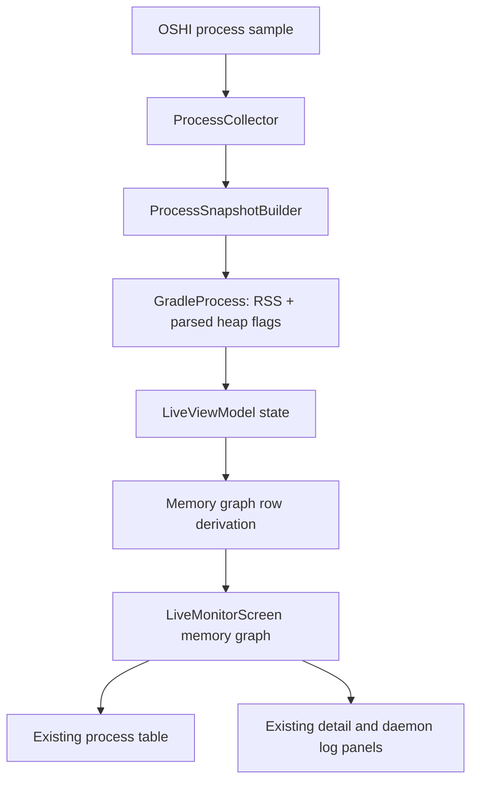

# Live Process Memory Graph

## Goal Capsule

| Field | Value |
|---|---|
| Objective | Add a live memory graph to Daemonitor's process monitor that compares RSS and configured JVM heap limits across the currently running Gradle-related processes. |
| User value | A developer can quickly see which daemon, wrapper, worker, or Kotlin daemon is occupying resident memory and how that compares to its JVM heap configuration. |
| Authority hierarchy | Prefer data already collected by `ProcessCollector` and `ProcessSnapshotBuilder`; label configured heap as capacity/limit, not live heap usage; keep the live monitor dense and operational rather than decorative. |
| Execution profile | Small UI/data-model enhancement with focused Compose UI tests and pure unit tests. |
| Stop conditions | Do not claim actual live heap occupancy unless a new JVM attach/JMX/jcmd path is intentionally added and tested. |

---

## Product Contract

### Summary

Daemonitor should show a compact visual comparison of memory across live Gradle-related processes.
The first release of the feature should use existing trustworthy process data: RSS from OSHI and configured JVM heap values parsed from command lines.
Actual live JVM heap used/committed is deferred because the current collector is process-level and does not attach to JVMs.

### Problem Frame

The live monitor currently exposes memory as table text and summary tiles: per-process RSS, total RSS, highest-memory PID, and process detail rows for `-Xmx`.
That is accurate but hard to scan when several Gradle daemons, Kotlin daemons, wrapper processes, and test workers are present.
A graph can make memory outliers visible without requiring the user to compare numbers row by row.

### Requirements

- R1. The live monitor shows a graph for the currently sampled Gradle-related processes when at least one process is present.
- R2. Each graph row represents one live `GradleProcess` and identifies it by process type plus PID, with project name shown when `projectPath` is available.
- R3. The primary bar represents RSS memory from `GradleProcess.rssMemoryMb`.
- R4. When `GradleProcess.maxHeapMb` is available, the graph shows it as configured heap capacity or heap limit, not as actual heap usage.
- R5. When heap flags are unavailable, the graph clearly renders RSS without implying missing heap data is zero.
- R6. The graph uses the existing live monitor visual language: Material theme colors, compact typography, fixed row heights, and no new chart dependency unless a local Compose implementation proves insufficient.
- R7. The existing table, summary tiles, detail panel, and daemon log remain available; the graph augments the monitor rather than replacing operational detail.
- R8. The plan defers actual live heap occupancy collection to a later explicit feature unless implementation chooses to add a separately tested JVM inspection path.

### Acceptance Examples

- AE1. Given a Gradle daemon with RSS 1024 MB and `-Xmx4g`, when the live monitor renders, then the graph row shows an RSS bar labeled 1024 MB and a heap-limit marker or companion bar labeled 4096 MB.
- AE2. Given a Gradle wrapper with RSS 180 MB and no `-Xmx`, when the graph renders, then the row shows RSS and labels heap limit as unavailable rather than 0 MB.
- AE3. Given multiple processes with different RSS values, when the graph renders, then the longest RSS bar corresponds to the highest RSS process.
- AE4. Given only one process, when the graph renders, then the graph still shows a stable single-row layout and does not collapse or resize the surrounding live monitor unexpectedly.
- AE5. Given a selected process exits, when `LiveViewModel` moves detail state to `Ended`, then the graph reflects only current live processes while the detail panel can still show the last-known process.

### Scope Boundaries

Deferred for later:

- Actual live heap used/committed collection through JMX, `jcmd`, or JVM attach APIs.
- Historical memory charts over time.
- Per-project memory aggregation beyond the current live process list.
- Alerting or thresholds beyond existing memory badges.

Outside this product's identity:

- Self-installing monitoring agents into target JVMs.
- Requiring Gradle processes to opt into extra instrumentation.
- Treating command-line heap flags as runtime heap occupancy.

---

## Planning Contract

### Key Technical Decisions

- KTD1. **Use RSS and configured heap first.** `ProcessInfo.rssBytes` already flows through `ProcessSnapshotBuilder` into `GradleProcess.rssMemoryMb`, and `JvmArgParser` already parses `-Xmx` and `-Xms`; this is enough for a useful first graph without new permissions, subprocess calls, or JVM attach behavior.
- KTD2. **Name heap data as limit/capacity.** The existing `JvmArgParser` comment explicitly says live heap occupancy is not observable externally in the current path. UI copy and tests must avoid phrases like "heap used" for `maxHeapMb`.
- KTD3. **Keep graph derivation in pure code.** Introduce a small model such as `MemoryGraphRow` or `ProcessMemoryRow` derived from `List<GradleProcess>` so sorting, scaling, missing heap handling, and labels are unit-testable outside Compose.
- KTD4. **Use a Compose-native bar component.** The repo already uses Material3, simple shared primitives, and a tiny `Canvas` icon; a custom row/bar using `Box` widths or `Canvas` is lower risk than adding a chart library for this narrow comparison.
- KTD5. **Integrate without replacing the process table.** The live monitor is currently a dense operational dashboard. The graph should live between the summary header and the table, or as a compact panel above the detail/log column, while preserving selection, table scanning, and logs.
- KTD6. **Defer JVM attach for true heap occupancy.** JMX or `jcmd` can be explored later, but it changes the collector contract, adds failure modes across OS/JDK/permissions, and would need separate redaction/security review.

### High-Level Technical Design

The first implementation does not need to alter OSHI polling.
It should treat the live process list as the source of truth and derive graph rows at the UI/view-model boundary.
The graph's scale should be based on the maximum visible value among RSS and available heap limits so markers/bars compare consistently.

### Implementation Constraints

- All new file references and documentation should use repo-relative paths.
- Keep row heights stable so adding/removing heap labels does not shift the dashboard.
- Avoid non-ASCII symbols in visible text unless the surrounding UI already uses them for the same semantic purpose.
- Preserve privacy posture: do not expose full working directories in the graph if the existing table only shows a project basename.
- Do not change database schema for this first version; the graph is live-only.

### Sequencing

1. Add pure memory graph row derivation and tests.
2. Add the Compose memory graph component with representative UI tests.
3. Integrate the graph into `LiveMonitorScreen` and update screenshot/docs only if the first viewport materially changes.

---

## Implementation Units

### U1. Memory Graph Row Derivation

- **Goal:** Convert `List<GradleProcess>` into stable display rows with RSS, optional heap limit, labels, and scale values.
- **Requirements:** R1, R2, R3, R4, R5, AE1, AE2, AE3, AE5.
- **Files:**
  - `src/main/kotlin/io/github/cdsap/daemonitor/ui/live/LiveUiState.kt`
  - `src/main/kotlin/io/github/cdsap/daemonitor/ui/live/LiveViewModel.kt`
  - Optional new file: `src/main/kotlin/io/github/cdsap/daemonitor/ui/live/MemoryGraphModel.kt`
  - `src/test/kotlin/io/github/cdsap/daemonitor/ui/live/LiveViewModelTest.kt`
  - Optional new test file: `src/test/kotlin/io/github/cdsap/daemonitor/ui/live/MemoryGraphModelTest.kt`
- **Approach:** Add a pure model for graph rows rather than embedding scaling and labels directly inside composables. Include fields for `pid`, `title`, `subtitle`, `rssMemoryMb`, `maxHeapMb`, `rssFraction`, `heapFraction`, and missing-heap state. Sort rows consistently with `state.processes` unless the product decision changes to "largest first"; preserving table order reduces surprise.
- **Test Scenarios:**
  - Given daemon/wrapper/test worker processes with different RSS values, derived rows preserve process identity and RSS values.
  - Given a process with `maxHeapMb`, the row exposes heap as an optional limit/capacity value.
  - Given a process without `maxHeapMb`, the row marks heap as unavailable without setting a zero fraction.
  - Given RSS lower than heap limit and another process RSS higher than all heap values, fractions scale against the maximum visible value.
  - Given no processes, derivation returns an empty row list and scale defaults safely.
- **Verification:** Run `./gradlew test --no-daemon --stacktrace --tests io.github.cdsap.daemonitor.ui.live.*`.

### U2. Compose Memory Graph Component

- **Goal:** Render a compact, readable memory comparison graph using existing theme primitives.
- **Requirements:** R1, R2, R3, R4, R5, R6, AE1, AE2, AE3, AE4.
- **Files:**
  - Optional new file: `src/main/kotlin/io/github/cdsap/daemonitor/ui/live/MemoryGraph.kt`
  - `src/main/kotlin/io/github/cdsap/daemonitor/ui/common/Components.kt` only if a reusable primitive is needed.
  - `src/test/kotlin/io/github/cdsap/daemonitor/ui/live/LiveMonitorScreenUiTest.kt`
  - Optional new test file: `src/test/kotlin/io/github/cdsap/daemonitor/ui/live/MemoryGraphUiTest.kt`
- **Approach:** Implement a small graph with fixed-height rows, labels on the left, an RSS bar, and an optional heap-limit marker or secondary track. Use `MaterialTheme.colorScheme` and `LocalAccentColors`; keep text small and clipped with ellipsis. Prefer `Box` width fractions for accessibility-friendly semantics; use `Canvas` only if marker drawing is simpler and tests remain stable.
- **Test Scenarios:**
  - The component renders "RSS" and "Heap limit" labels or equivalent accessible text so tests and screen readers can distinguish the values.
  - A process with missing heap limit renders an "unavailable" label and still displays RSS.
  - The largest RSS process has a full-width or max-scale bar relative to other rows.
  - A single row renders without occupying excessive vertical height.
  - Long project names and command-derived labels do not overflow their row.
- **Verification:** Run `./gradlew test --no-daemon --stacktrace --tests io.github.cdsap.daemonitor.ui.live.LiveMonitorScreenUiTest`.

### U3. Live Monitor Integration and Documentation Decision

- **Goal:** Place the graph in the live monitor without reducing the usability of the table, detail card, or log card.
- **Requirements:** R1, R6, R7, R8, AE4, AE5.
- **Files:**
  - `src/main/kotlin/io/github/cdsap/daemonitor/ui/live/LiveMonitorScreen.kt`
  - `src/test/kotlin/io/github/cdsap/daemonitor/ui/live/LiveMonitorScreenUiTest.kt`
  - `src/test/kotlin/io/github/cdsap/daemonitor/docs/ReadmeScreenshotCapture.kt` if screenshots include the changed live monitor viewport.
  - `docs/images/live-monitor.png` only if screenshot regeneration is intentionally included.
  - `README.md` only if visible documentation should call out the graph.
- **Approach:** Start with the graph as a compact panel immediately below the summary header and above the table/detail split, or as a top panel in the left column above the table if vertical space is tighter. Keep the table visible in normal desktop dimensions. Label heap as configured heap limit in the detail or legend, and keep true heap occupancy deferred.
- **Test Scenarios:**
  - Existing live monitor tests for scanning, degraded status, table row, and detail scrolling still pass.
  - With live processes, the graph appears and the process table remains present.
  - With no processes, the graph is absent and the existing empty state remains unchanged.
  - Selecting a process still updates the detail card while the graph remains stable.
  - If documentation screenshots are regenerated, `ReadmeScreenshotsTest` continues to validate privacy-safe sample content.
- **Verification:** Run `./gradlew test --no-daemon --stacktrace`; if screenshots are changed, run `./gradlew captureReadmeScreenshots --no-daemon --stacktrace`.

---

## Verification Contract

| Gate | Command | Covers | Done Signal |
|---|---|---|---|
| Pure model tests | `./gradlew test --no-daemon --stacktrace --tests io.github.cdsap.daemonitor.ui.live.*` | U1, U2 | Memory graph derivation and live UI tests pass. |
| Full test suite | `./gradlew test --no-daemon --stacktrace` | U1, U2, U3 | Existing live monitor, collection, history, settings, update, and MCP tests remain green. |
| Screenshot documentation, if changed | `./gradlew captureReadmeScreenshots --no-daemon --stacktrace` | U3 | README screenshots regenerate from deterministic sample state without leaking real paths or processes. |
| Manual visual check | Run the desktop app with several Gradle-related processes active. | U2, U3 | Graph shows RSS and configured heap limit clearly; table/detail/log remain usable. |

---

## Definition of Done

- The live monitor includes a memory graph for current Gradle-related processes.
- RSS is visually prominent and uses `rssMemoryMb`.
- Configured heap is explicitly labeled as a heap limit or capacity when `maxHeapMb` exists.
- Missing heap flags render as unavailable, not zero.
- Existing table, detail, selection, ended-process, degraded-poll, and log behavior remain intact.
- No new JVM attach, JMX, or `jcmd` behavior is added unless it is deliberately scoped, tested, and documented as a separate implementation path.
- Tests listed in the Verification Contract pass.
- Any abandoned experimental chart code or unused data fields are removed before completion.

---

## Appendix

### Current Code Anchors

- `src/main/kotlin/io/github/cdsap/daemonitor/domain/model/GradleProcess.kt` already carries `rssMemoryMb`, `maxHeapMb`, and `minHeapMb`.
- `src/main/kotlin/io/github/cdsap/daemonitor/collect/ProcessSnapshotBuilder.kt` maps `ProcessInfo.rssBytes` into `rssMemoryMb` and parses JVM args.
- `src/main/kotlin/io/github/cdsap/daemonitor/collect/JvmArgParser.kt` parses `-Xmx`, `-Xms`, and GC flags, and explicitly notes that live heap occupancy is not observable externally through this path.
- `src/main/kotlin/io/github/cdsap/daemonitor/ui/live/LiveMonitorScreen.kt` owns the current summary header, process table, detail card, and log card layout.
- `src/main/kotlin/io/github/cdsap/daemonitor/ui/live/LiveViewModel.kt` owns summary derivation and selected-process transitions.
- `src/test/kotlin/io/github/cdsap/daemonitor/ui/live/LiveMonitorScreenUiTest.kt` is the closest existing UI test surface for live monitor rendering and layout behavior.
